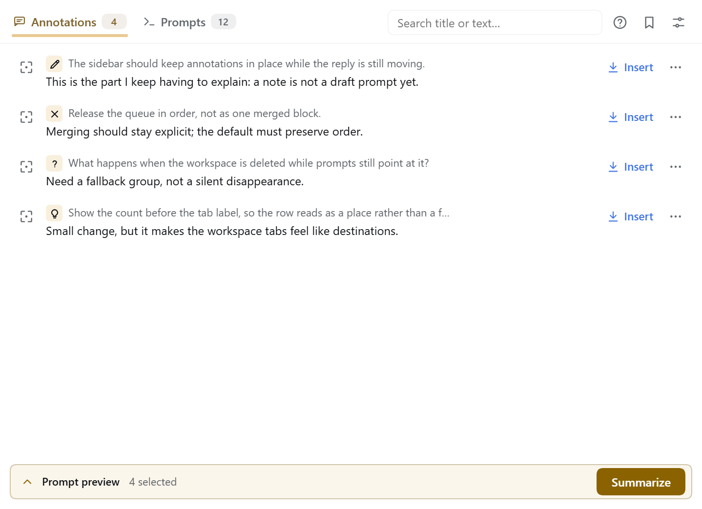

# Prompt pool · 提示池

[](https://www.npmjs.com/package/dsh-prompt-pool) [](https://dshfind.com/en/plugins/Ganttfly/dsh-prompt-pool?ref=badge)

A prompt staging pool for DeepSeek Harness: park a draft until it is ready, queue the next prompts in
order, and annotate a long reply without losing the sentence you mean. Nothing runs until you release it.

Agent work breaks between messages: a half-written prompt, a sequence to run, a passage to comment on.
The pool keeps the draft, the next action and the exact wording next to the conversation.




- Composer trigger beside the send controls (accent + count while something is queued)
- Starter prompts follow the host language; Settings can reset them in the current interface language, keeping edits as ordinary items
- Composer panel scoped to **Annotations** (current session) and **Prompts** (current workspace), with search,
  type filtering, row actions and a session-scoped send queue
- Right-click on selected conversation text to copy it or save it into a group (the last destination leads the menu)
- Annotate while you read: choose a kind from the right-click submenu, keep notes on the exact passage with image
  attachments, collect them in the current-session tab, and send the checked ones as one review prompt straight to
  the session queue or into the outbox (new notes default to Agree)
- Full-height page in the right sidebar (native tab on DSH 0.2+, `dsh-better-sidebar` fallback) with **Current
  session / Current workspace / Global shared pool** scopes
- Single prompt type per item (decision / question / opinion / idea / supplement / to-do / inspiration), seeded
  from the annotation kind and editable in the save step
- A save step for title, body, images, type and destination, with a reminder that the conversation context is not kept
- Global shared pool keeps the built-in, custom and display-mode group tabs; workspace prompts use type filters
- Settings for annotation retention, post-use retention, the built-in prompt reset, and global shared-pool group order/display; the page opens on Annotations and has no workspace-tab controls
- A release shows progress and can be stopped; the unsent queue stays
- A dock strip above the composer sits beside the host's own queued messages and pushes the whole send
  queue into it in one click
- Confirmations for destructive actions, with undo on deletes and clears

Requires DSH >= 0.2.0-rc.1 (verified on 0.2.2-rc.1). This is a **bundle**: install the package, then
enable it in Settings → Plugins.

```powershell
dsh plugin add dsh-prompt-pool --profile <profile>
```

Full documentation: <https://github.com/Ganttfly/dsh-prompt-pool#readme> ·
[中文说明](https://github.com/Ganttfly/dsh-prompt-pool/blob/main/README.zh.md)

## Known limitations

- Non-image attachments are not captured (the toast reports how many were left behind).
- Reference chips (`@file`, `@session`) are stored and re-inserted as text, not clickable chips.
- A capture copies; it does not clear the composer.

MIT
